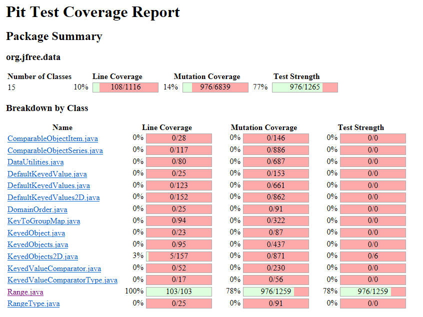
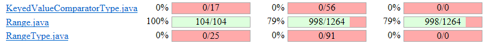
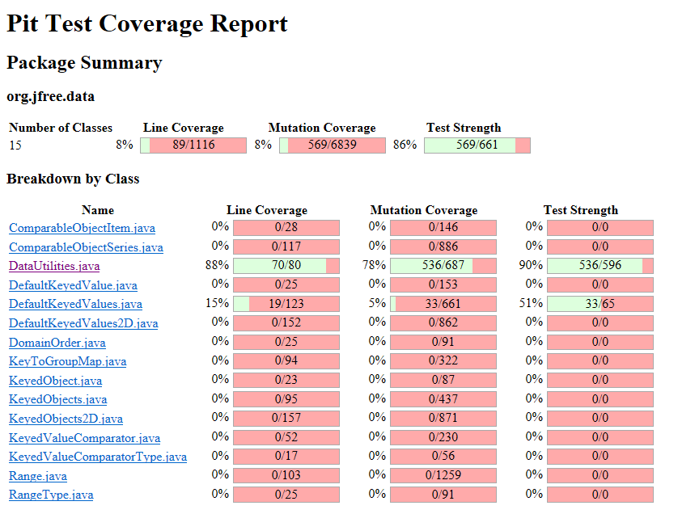

**SENG 438 - Software Testing, Reliability, and Quality**

**Lab. Report \#4 – Mutation Testing and Web app testing**

| Group \#:      |   2  |
| -------------- | --- |
| Student Names: |  Jana |
|                |  Joshua   |
|                |   Ernest  |
|                |  Robert   |

# Introduction

This lab has two parts. Part 1 focuses on mutation testing using a previously developed test suite and Part 2 explores GUI testing using record and replay tools. 
In Part 1, we will mutation test our existing test suites for Range and DataUtilities. We will then analyze the results and develop additional test cases to improve mutation coverage by killing the surviving mutants. In Part 2, we will develop test cases for different functionalites on the Amazon website.


# Analysis of 10 Mutants of the Range class 
<strong>Mutant 1</strong><br>
Line: 176 in intersects(Range range)<br>
Original Code: return intersects(range.getLowerBound(), range.getUpperBound());<br>
Mutated Code: return true;<br>
Mutant Status: SURVIVED<br>
Summary: This mutant survived because the two tests that test that
function test ranges that overlap with the demoRange thus changing the outcome to true will not change the output of the tests.<br><br>

<strong>Mutant 2</strong><br>
Line: 197 in constrain(double value)<br>
Original Code: return result;<br>
Mutated Code: return (result++);<br>
Mutant Status: SURVIVED<br>
Summary: This mutant survived because it incremented the value after it was
already returned thus the tests for that function didn't test what happened to the variables after the value was returned
and thus couldn't kill the mutant.<br><br>

<strong>Mutant 3</strong><br>
Line: 197 in constrain(double value)<br>
Original Code: return result;<br>
Mutated Code: return (result--);<br>
Mutant Status: SURVIVED<br>
Summary: Much like the previous mutant this mutant survived because
the tests do not check if the variables are correct after a value was already returned.<br><br>

<strong>Mutant 4</strong><br>
Line: 409 in scale(Range base, double factor)<br>
Original Code: ParamChecks.nullNotPermitted(base, "base");<br>
Mutated Code: Removed the function call<br>
Mutant Status: SURVIVED<br>
Summary: This mutant survived because the tests for scale never pass along a null range thus the call to nullNotPermitted is not
needed in them and if removed won't be noticed.<br><br>

<strong>Mutant 5</strong><br>
Line: 475 in toString()<br>
Original Code: return ("Range[" + this.lower + "," + this.upper + "]");<br>
Mutated Code: return ("Range[" + (this.lower++) + "," + this.upper + "]");<br>
Mutant Status: SURVIVED<br>
Summary: This mutant survived because it only incremented the value after it
was used to make the string, since none of our tests test the values of the range used in the function after the function
was executed the mutant is never killed.<br><br>

<strong>Mutant 6</strong><br>
Line: 123 in getLength()<br>
Original Code: return this.upper - this.lower;<br>
Mutated Code:	retrun this.upper + this.lower;<br>
Mutant Status: KILLED<br>
Summary: All the unit test for the method getLength() use test cases that have unique values when the lower bound is subtracted from the upper bound. The most important consideration is that lower != 0 because upper - 0 == upper + 0.<br><br>

<strong>Mutant 7</strong><br>
Line: 132 in getCentralValue()<br>
Original Code: return this.lower / 2.0 + this.upper / 2.0;<br>
Mutated Code: return this.lower / 1.0 + this.upper / 2.0;<br>
Mutant Status: KILLED<br>
Summary: This mutant test still accurately fails because the expected central value can be harded in the unit test. This mutation essentially equates to incorrect math, and its failure means the test would catch such a bug.<br><br>

<strong>Mutant 8</strong><br>
Line: 114 in getUpperBound()<br>
Original Code: return this.upper;<br>
Mutated Code: return this.upper++;<br>
Mutant Status: KILLED<br>
Summary: This test fails because the expected upper bound is known. Thus, when the actual value is incremented, the function returns a value differing from the expected, and it fail the unit test.<br><br>

<strong>Mutant 9</strong><br>
Line: 144 in contains()<br>
Original Code: return (value >= this.lower && value <= this.upper);<br>
Mutated Code: return (value >= this.lower && value == this.upper);<br>
Mutant Status: KILLED<br>
Summary: If the unit test expected value is true (input is contained in range), but not the input is not equal to the upper bound, then this mutation will return false. This fails the test and kills the mutation.<br><br>

<strong>Mutant 10</strong><br>
Line: 217 in combine();<br>
Original Code: if(range1 == null) {<br>
Mutated Code: if(range1 != null) {<br>
Mutant Status: KILLED<br>
Summary: This mutant changes the truth value of the conditional statement. This means the function does not enter the proper decision-branch, so it returns something other than the expected result and the test fails.<br><br>

# Report all the statistics and the mutation score for each test class
<strong>Range Initial:</strong><br>
<br>

<strong>Range Improved:</strong><br>
<br>
  
 <strong>DataUtilities Initial:</strong><br>
<br>

<strong>DataUtilities Improved:</strong><br>
<br>

# Analysis drawn on the effectiveness of each of the test classes

Initially, both test cases were fairly effective, as both classes had a mutation coverage of 78%. After the test improvements, the Datautilities tests are very effective. These tests now kill 90% of mutations, meaning the test suite is very resistant to mutations. Of the remaining 10% of mutations, some are semantically equivalent (discussed below), so they do not change the code logic. The Range tests were difficult to improve. We attempted to add more test cases, which gained some mutation coverage, but the change was incremental.

# A discussion on the effect of equivalent mutants on mutation score accuracy

Equivalent mutations had a detrimental effect on our mutation coverage, thus making the score slightly inaccurate. For example, in DataUtilities, the methods implement several for-loops. In these for-loops, a common mutation was, for example, changing the loop condition from i < 10 to i != 10. The Pitest mutation tool would flag these mutations as surviving, however they are logically equivalent in the context of a for-loop, so there is no way to kill them. Mutations like this decreased our mutation coverage score in both test classes.

# A discussion of what could have been done to improve the mutation score of the test suites

To improve our test suites' mutation scores, we developed specific test cases that targetted certain mutations. For example, consider the method Range.getCentralValue():
 ```
     public double getCentralValue() {
        return this.lower / 2.0 + this.upper / 2.0;
    }
```
A mutation present in this method was to increment and decrement the local variables (this.lower and this.upper). Because our previous test cases only focused on the return of the function and not the fucntion's affect on the object, these mutations survived. To kill these mutants, we developed unit tests that targetted the fucntion's affect on the object, not the function's return value: 
```
	@Test
	public void preventLowerIteration() {
		Range r = new Range(1,2);
		r.getCentralValue();
		assertTrue("Test Iterative Mutants", (r.getLowerBound() == 1));
	}
	
	@Test
	public void preventUpperIteration() {
		Range r = new Range(1,2);
		r.getCentralValue();
		assertTrue("Test Iterative Mutants", (r.getUpperBound() == 2));
	}
```

Another method we used was changing our unit test inputs. When increasing the mutation coverage, it is crucial to be intentional about the input values. For example, consider Range.getCentralValue() again. If the test range was [-1,0] for example, the a mutation that changes the sign of the function's arithmetic would not fail because (-1/2 + 0/2) == (-1/2 - 0/2).
 

# Why do we need mutation testing? Advantages and disadvantages of mutation testing

Mutation testing tests the quality of the tests, not necessarily the quality of the code. The goal of mutation testing is to evaluate a test suite's ability to detect bugs; if the mutation coverage is poor, than the tests will not be effective when testing the source code. The biggest advantage to mutation testing is that it promotes targetted test cases that are of high quality.

There are some disadvantages of mutations include. First, the mutation-killing test cases are sometimes difficult to develop, meaning a time comnsuimng test-writing process. Additionally, the actual running of the mutation test are computationally and temporally expensive because a large number of inputs and mutations are tested.

# Explain your SELENUIM test case design process

We would go explore the Amazon website seacrhing for effective functionalities to test. After determining a function to test, we would explore what elements differed on each screen, so we could choose what we wanted to use as our validation points. From there we would do a dry run of the steps to perform that test. Afterwards, we eould start a recording in Selenium and perform the steps again. Finally, we executed the test a few times to verify that no errors were present.

# Explain the use of assertions and checkpoints

We used verification checkpoints and assertions in order to verify that the test is running as it should. We did this by testing what page the site is currently on or the contents of the current page. This is an important feature as it saves time in case you are on an incorrect page so you don’t have to continue. We used a combination of both verification and assertion checkpoints, mainly to check certain texts to make sure you are on the right page or the feature that was selected did the right thing.

# How did you test each functionaity with different test data
We tested the following functionalities.

1.	Logging in
2.	Search bar
3.	Change language
4.	Redirecting to Amazon main page
5.	Customer service button
6.	Sort
7.	Region
8.	Sign out<br>
For different test data for the logging in, we signed in with correct data and then signed in with incorrect data and got different results by doing so. For the region, we tested different countries to make sure that the feature works properly. In Addition, we did a similar test for language. We changed the language in order to make sure that the feature works as it should. To test for sorting feature, we tested sorting high to low and low to high. 

# Discuss advantages and disadvantages of Selenium vs. Sikulix

The biggest difference between the two programs was their deployment. Selenium, being a browser extension, was significantly easier to install and use compared to Sikulix. Additionally, Sikulix was less intuitve, making it more difficult to run tests; Selenium was simple to use.  

# How the team work/effort was divided and managed

For Part 1, we split the work up into pairs. Similar to previous labs, each pair was responsible for developing and running the tests for a class. We employed pair programming, so each new test case was developed by both pair members.

For Part 2, we employed a similar strategy, however one group ran into computers issues, so the other group ended up writing more test cases.

For the lab document, the questions were answered by the group collaboratively, with Joshua recording the answers.


# Difficulties encountered, challenges overcome, and lessons learned

The most significant issue with this lab was the Eclispe IDE when using Pitest. The IDE crashed multiple times for all group members when running the mutation tests. Additionally, when not crashing, the Pitests were clunky and slowed down performance significantly.

Additionally, when using Selenium, we had difficulties running it on MacOS. It eventually worked, but was inconsistent.

# Comments/feedback on the lab itself

This lab was helpful as mutation testing is a foreign and complex concept. Getting hands-on experience with it is valuable when developing test cases. GUI testing tools are also important, and this lab provided helpful exposure to a number of options. 
